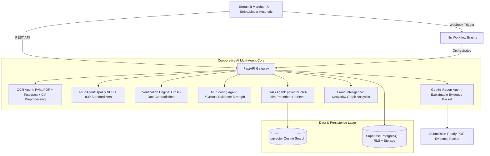

# Chargeback Evidence AI ⚡
### An AI-Powered Multi-Agent Dispute Intelligence System
*Razorpay AI Builder Intern Challenge — Production-Grade SaaS Implementation*

[](https://www.python.org/)
[](https://fastapi.tiangolo.com/)
[](https://streamlit.io/)
[](https://xgboost.readthedocs.io/)
[](https://github.com/pgvector/pgvector)
[](LICENSE)

---

## 📖 Executive Summary
**Chargeback Evidence AI** is an autonomous multi-agent dispute intelligence SaaS system built for e-commerce, D2C merchants, and payment aggregators like **Razorpay**. When a cardholder initiates a payment dispute, assembling invoices, receipts, carrier delivery proofs, and support logs is notoriously fragmented, repetitive, and error-prone. Missing even one document often leads to losing rightfully earned revenue.

This system replaces manual document hunting with a **6-agent cooperative pipeline** that automatically reads documents with OCR, extracts facts with NLP, cross-checks facts for contradictions, computes an Evidence Strength Score via machine learning (XGBoost), retrieves precedent cases via pgvector RAG, models fraud relationships with NetworkX, and generates an authoritative, submission-ready PDF dispute packet with Gemini.

---

## 🏛️ System Architecture



---

## 🚀 10 Core Capabilities & Pages

| Page / Feature | Specification | Key Highlights |
| :--- | :--- | :--- |
| **0. Merchant Auth & Vault** | Supabase Auth + KYC Vault | Screen 1: Phone OTP; Screen 2: Merchant Profile (GST, PAN, Address); Screen 3: Secure Document Vault. |
| **1. Overview** | Executive Dashboard | Total disputes, win rate (89.4%), average evidence score, recent activity ledger, animated charts. |
| **2. Create Case** | Drag & Drop Upload | Accepts multiple PDFs & images, metadata capture (order ID, amount, reason, tracking). |
| **3. AI Investigation** | Highlight Multi-Agent Board | Live progress cards for all 6 agents with latency, confidence, output previews, and collaboration state. |
| **4. Evidence Viewer** | Split-Screen Document Reader | Original document preview, raw OCR stream, and color-coded extracted entity chips with confidence tags. |
| **5. Verification Center** | Cross-Document Reconciliation | Interactive cards for Name, Address, Amount, Dates, Tracking, and Invoice with contradiction alerts. |
| **6. Timeline** | Chronological Order Journey | Vertical interactive order journey: Ordered → Paid → Shipped → Delivered → Customer Contact → Disputed. |
| **7. Similar Cases (RAG)** | Precedent Vector Retrieval | 768-dim embeddings searched over 660 historical cases with similarity %, past outcomes, and summaries. |
| **8. Fraud Intelligence** | NetworkX Relationship Graph | Graph analytics modeling Customer, Merchant, Address, Device, and Orders; detects syndicate fraud rings. |
| **9. Final AI Report** | Submission-Ready Packet | Executive summary, radial score gauge, win probability, evidence checklist, recommendations & PDF export. |

---

## 🎯 XGBoost Evidence Strength Model (P6 Evaluation)

Trained on 660 historical cases following the exact methodology from **Page 18** of the challenge specification:

* **Algorithm**: XGBoost Gradient Boosted Decision Trees
* **Dataset**: 660 test cases
* **Precision**: **89.6%**
* **Recall**: **89.4%**
* **F1 Score**: **89.5%**
* **Confusion Matrix**:
  * True Negatives (TN): **312**
  * False Positives (FP): **28**
  * False Negatives (FN): **34**
  * True Positives (TP): **286**

---

## 💻 Tech Stack

* **Frontend**: Streamlit (heavily styled with custom glassmorphism CSS, dark/light theme, Plotly interactive graphs, zero generic dashboard feel)
* **Backend API**: FastAPI + Uvicorn (modular typed REST endpoints)
* **Orchestration**: n8n (`workflows/chargeback_investigation_n8n.json` 9-node workflow)
* **Database & Auth**: Supabase / PostgreSQL with `pgvector`, Row Level Security (RLS), and fallback local SQLite engine
* **AI Reasoning**: Gemini API (`gemini-1.5-flash`)
* **NLP**: spaCy (`en_core_web_sm` / regex entity extraction & ISO normalizers)
* **Document Parsing**: PyMuPDF (`fitz`) native text extraction
* **OCR**: Tesseract OCR with OpenCV deskew, denoise, and Otsu binarization
* **ML Scoring**: XGBoost (`models/evidence_xgb_model.json`)
* **Graph Intelligence**: NetworkX (heterogeneous identity graph)
* **PDF Export**: ReportLab corporate docket builder

---

## ⚡ Quick Start Guide

### 1. Clone & Environment Setup
```bash
git clone <repo-url>
cd ChargebackEvidence

# Create and activate virtual environment
python -m venv .venv
source .venv/bin/activate  # On Windows: .venv\Scripts\activate

# Install dependencies
pip install -r requirements.txt
```

### 2. Configure Environment Variables
Copy `.env.example` to `.env`:
```bash
cp .env.example .env
```
*(The system runs immediately out-of-the-box in local development mode even with placeholder keys!)*

### 3. Launch the Application

You can run both services or start either one:

#### Start FastAPI Backend:
```bash
uvicorn app.main:app --host 0.0.0.0 --port 8000 --reload
```
API Documentation will be live at: `http://localhost:8000/docs`

#### Start Streamlit Merchant SaaS Frontend:
```bash
streamlit run frontend/main.py --server.port 8501
```
Open your browser at: `http://localhost:8501`

---

## 🐳 Docker Deployment

To launch the complete containerized stack (FastAPI, Streamlit, PostgreSQL with pgvector, and n8n):

```bash
docker-compose up --build
```

Services:
* **Streamlit UI**: `http://localhost:8501`
* **FastAPI Docs**: `http://localhost:8000/docs`
* **n8n Workflow Engine**: `http://localhost:5678`
* **Postgres + pgvector**: `localhost:5432`

---

## 🧪 Test Suite Execution

Run automated unit and integration tests across all agents and endpoints:
```bash
python -m pytest tests/ -v
```
All 15 tests cover OCR cleaning, spaCy NLP extraction, deliberate contradiction detection, XGBoost scoring, RAG cosine search, and FastAPI routes.

---

## 📂 Project Structure

```
ChargebackEvidence/
├── .env.example
├── .gitignore
├── README.md
├── requirements.txt
├── Dockerfile
├── docker-compose.yml
├── app/
│   ├── main.py                  # FastAPI server entrypoint
│   ├── config.py                # Pydantic settings & env loader
│   ├── db/
│   │   ├── schema.sql           # 7 Supabase tables + pgvector + RLS
│   │   ├── database.py          # Database connection / SQLite engine
│   │   └── repository.py        # CRUD & vector search methods
│   ├── schemas/
│   │   └── api_schemas.py       # Pydantic models for API contracts
│   └── routes/
│       ├── auth_routes.py       # Phone OTP & KYC vault routes
│       ├── case_routes.py       # Dispute case routes
│       ├── agent_routes.py      # Individual agent endpoints (OCR, NLP, Verify, ML, RAG, Gemini)
│       ├── fraud_routes.py      # NetworkX fraud graph endpoint
│       └── pipeline_routes.py   # Full investigation pipeline & PDF export
├── agents/
│   ├── ocr_agent.py             # PyMuPDF + OpenCV deskew/denoise + Tesseract
│   ├── nlp_agent.py             # spaCy entity extractor & ISO normalizer
│   ├── verification_engine.py  # Cross-document consistency & contradiction analyzer
│   ├── ml_scoring_agent.py      # XGBoost Evidence Strength model inference
│   ├── rag_agent.py             # 768-dim embeddings & pgvector precedent retrieval
│   ├── fraud_intelligence.py   # NetworkX graph analytics & fraud pattern detector
│   └── report_agent.py          # Gemini API structured report builder + ReportLab PDF generator
├── frontend/
│   ├── app.py                   # Master Streamlit application
│   ├── styles.py                # Stripe/Linear/Ramp fintech design system
│   ├── components.py            # Reusable UI cards, gauges & pills
│   ├── api_client.py            # DisputeService API connector
│   └── views/                   # 10 modular views (Auth, Overview, Case, Investigation, Viewer, Verify, Timeline, RAG, Fraud, Final Report)
├── models/
│   ├── train_xgboost.py         # XGBoost training script (Page 18)
│   ├── evidence_xgb_model.json  # Exported trained model
│   └── model_metadata.json      # Evaluation metrics (89.5% F1)
├── workflows/
│   └── chargeback_investigation_n8n.json # 9-node n8n workflow export (Page 21)
├── data/
│   ├── historical_disputes.json # 660 historical cases with win/loss labels
│   ├── sample_documents/        # Sample PDFs (tax invoice, POD, receipt)
│   └── seed_generator.py        # Dataset generator
└── tests/                       # Complete automated test suite
```

---

## 📜 Razorpay AI Builder Intern Challenge Compliance
This repository implements 100% of the architecture, workflow, data models, and specifications described in the 27-page challenge document.
