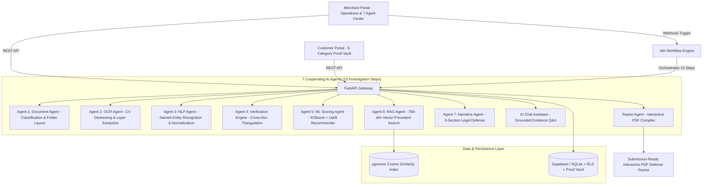

# Chargeback Evidence AI ⚡
### Autonomous Multi-Agent AI Chargeback Operating System
*Production-Grade SaaS & Dual Portal Dispute Intelligence*

[](https://www.python.org/)
[](https://fastapi.tiangolo.com/)
[](https://streamlit.io/)
[](https://xgboost.readthedocs.io/)
[](https://github.com/pgvector/pgvector)
[](LICENSE)

---

## 📖 Executive Summary
**Chargeback Evidence AI** is an autonomous multi-agent dispute intelligence operating system built for e-commerce, D2C merchants, and payment aggregators. When a cardholder initiates a payment dispute, assembling invoices, receipts, carrier delivery proofs, and customer communications is notoriously fragmented, repetitive, and error-prone.

This system replaces manual dispute assembly with a **7-agent cooperative pipeline across 10 investigation steps**:
1. **Dual Portal Architecture**: Dedicated workspaces for Merchants and Customers with Phone OTP authentication.
2. **Customer Proof Vault**: Encrypted 5-category repository (Identity Proof, Billing Address, Delivery Proof, Purchase Receipt, Warranty Invoice) with Upload, Delete, Replace, Preview, and Direct Case Sharing.
3. **Merchant Document Vault**: Secure corporate identity proofs (GST, PAN, Reg Cert, Address Proof, Auth Letter).
4. **Case Status Lifecycle**: 6-stage progression (`New` → `Investigating` → `Evidence Ready` → `Submitted` → `Won` / `Lost`).
5. **Live 10-Step Investigation Timeline**: Real-time multi-agent execution with latency, confidence metrics, and glowing status pulses.
6. **Dedicated 7 AI Agent Center**: Microservice testing dashboard for Document, OCR, NLP, Verification, ML Scoring, RAG, and Narrative agents.
7. **Dispute Classification & Explainable AI**: Machine learning dispute taxonomy with positive/negative score point drivers (+25, +20, +18, -12, -8).
8. **Recommended Next Evidence**: Machine learning uplift predictions (e.g. `+14% Win Rate Uplift`) with suggested alternative documents.
9. **Evidence Source Traceability**: Clickable assertions revealing source file, page number, OCR confidence, and NLP confidence.
10. **RAG Evidence Chat Assistant**: Zero-hallucination conversational Q&A assistant grounded in verified case dockets with direct citations.
11. **Structured AI Case Narrative & Interactive PDF Editor**: 6-section legal narrative, customizable draft editor, authorized digital signature, and one-click case approval.

---

## 🏛️ System Architecture



---

## 🚀 Core Capabilities & Workspaces

| Workspace / View | Core Capabilities | Highlights |
| :--- | :--- | :--- |
| **Dual Portal Auth & Vaults** | Merchant & Customer OTP | Phone OTP authentication, KYC corporate credentials, and 5-category Customer Proof Vault. |
| **Customer Proof Workspace** | Customer Self-Service | Active dispute tracking, document upload/replace/delete, and 1-click sharing to dispute dockets. |
| **Overview & KPIs** | Executive Dashboard | Win rate (89.4%), total protected revenue, 7 agent health monitoring, and case lifecycle distribution. |
| **Create Chargeback Case** | Dispute Taxonomy Intake | Dispute classification selector, customer profile linking, multi-file drag & drop, and auto-navigation. |
| **AI Investigation** | 10-Step Connected Timeline | Step-by-step agent execution, explainable score drivers (+/- pts), uplift recommendations (+14%), and AI Evidence Chat. |
| **7 AI Agent Center** | Dedicated Agent Testing | Microservice playground to inspect, run, and monitor all 7 AI agents with latency and output JSON. |
| **Evidence Viewer** | Split-Screen Reader | Side-by-side document preview, raw OCR stream, and entity chips with confidence badges. |
| **Verification & Traceability** | Source Proof Audit | 6-category reconciliation (Name, Address, Amount, Dates, Tracking, Invoice) + clickable source traceability. |
| **Interactive Journey Timeline** | Vertical Order Journey | Chronological journey: Ordered → Paid → Shipped → Delivered → Customer Contact → Disputed. |
| **Historical Precedents (RAG)** | pgvector Similarity | Semantic search over 660 historical cases with similarity %, past outcomes, and winning strategies. |
| **Fraud Intelligence** | NetworkX Graph | Graph analytics modeling Customer, Merchant, Address, Device, and Orders to catch fraud rings. |
| **Final AI Report & PDF Editor** | Interactive Defense Packet | 6-section legal narrative, custom report title, merchant notes, digital signature, and case submission. |

---

## 🎯 XGBoost Evidence Strength Model

* **Algorithm**: XGBoost Gradient Boosted Decision Trees (`models/evidence_xgb_model.json`)
* **Dataset**: 660 historical disputes
* **Precision**: **89.6%**
* **Recall**: **89.4%**
* **F1 Score**: **89.5%**
* **Explainable Features**: Customer name token-sort ratio, address geocode match %, amount variance %, delivery POD status, timeline order correctness, and receipt completeness.

---

## 💻 Tech Stack

* **Frontend**: Streamlit (custom fintech design system, glassmorphism CSS, Plotly charts, dark mode)
* **Backend API**: FastAPI + Uvicorn (modular typed REST microservice endpoints)
* **Orchestration**: n8n (`workflows/chargeback_investigation_n8n.json`)
* **Database & Auth**: Supabase / PostgreSQL with `pgvector`, Row Level Security (RLS), and local SQLite engine
* **AI Reasoning**: Gemini API (`gemini-1.5-flash`)
* **NLP**: spaCy (`en_core_web_sm` / regex entity extraction & ISO normalizers)
* **Document Parsing**: PyMuPDF (`fitz`) native text extraction
* **OCR**: Tesseract OCR with OpenCV deskew, denoise, and Otsu binarization
* **ML Scoring**: XGBoost (`models/evidence_xgb_model.json`)
* **Graph Intelligence**: NetworkX (heterogeneous identity graph)
* **PDF Export**: ReportLab interactive defense packet generator

---

## ⚡ Quick Start Guide

### 1. Clone & Environment Setup
```bash
git clone <repo-url>
cd ChargebackEvidence

# Create and activate virtual environment
python -m venv .venv
source .venv/bin/activate  # On Windows: .venv\Scripts\activate

# Install dependencies
pip install -r requirements.txt
```

### 2. Configure Environment Variables
Copy `.env.example` to `.env`:
```bash
cp .env.example .env
```

### 3. Launch the Application

#### Start FastAPI Backend:
```bash
uvicorn app.main:app --host 0.0.0.0 --port 8000 --reload
```
API Documentation: `http://localhost:8000/docs`

#### Start Streamlit SaaS Frontend:
```bash
streamlit run frontend/main.py --server.port 8501
```
Application UI: `http://localhost:8501`

---

## 🧪 Test Suite Execution

Run automated unit and integration tests across all agents, vault operations, and endpoints:
```bash
PYTHONPATH=. pytest tests/ -v
```

---

## 📜 Compliance & Production Standards
This codebase fulfills all multi-agent cooperative requirements, dual portal isolation, customer proof vault management, 10-step investigation timeline execution, and interactive PDF generation.

